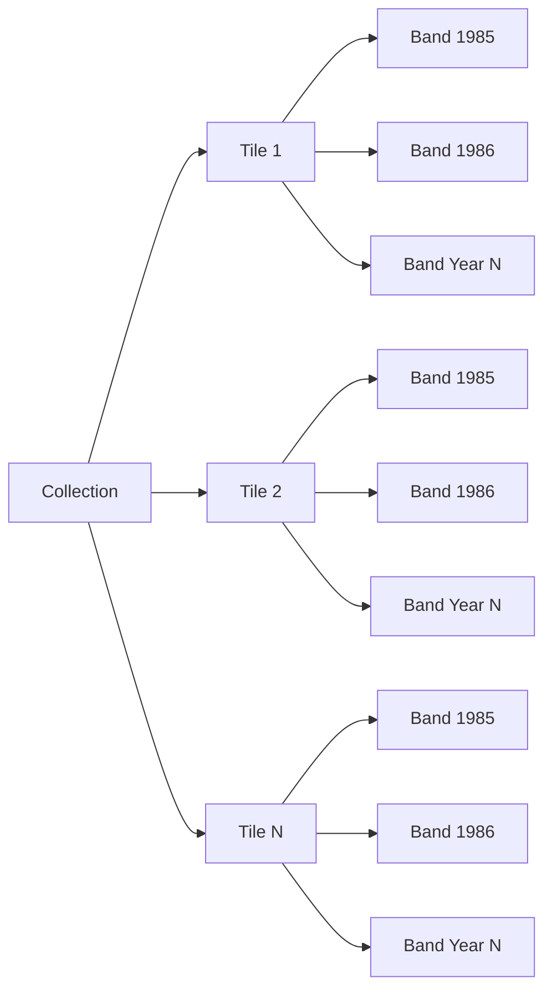

```mermaid
flowchart LR
    C["Collection"] --> T1["Tile 1"]
    C --> T2["Tile 2"]
    C --> TN["Tile N"]

    T1 --> B11["Band 1985"]
    T1 --> B12["Band 1986"]
    T1 --> B1N["Band Year N"]

    T2 --> B21["Band 1985"]
    T2 --> B22["Band 1986"]
    T2 --> B2N["Band Year N"]

    TN --> BN1["Band 1985"]
    TN --> BN2["Band 1986"]
    TN --> BNN["Band Year N"]

```